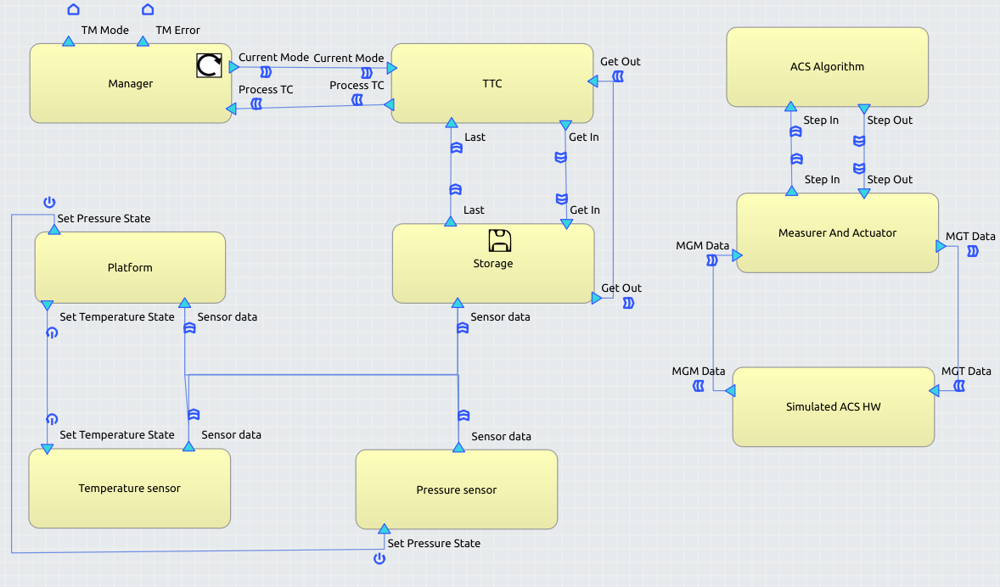

# cFS-UPM-Sat2-Skeletons 

=================

Code skeletons of the [OBDH system](https://github.com/STR-UPM/OBDH_LABS/tree/master/PROJECT)
using a modified [TASTE toolchain](https://taste.tools/) that generates automatically the code skeletons for cFS applications.

TASTE is a toolchain supported and developed by the European Space Agency together
with academics and European space industry partners.
This tool follows a Component-Based Development (CBD) approach and automatic
code generation for the development of heterogeneous real-time embedded systems (RTE).

The Core Flight System (cFS) is a platform and flight software framework used by NASA in spacecraft missions. It provides a reusable and modular software architecture that can be customized and extended to support a wide range of spacecraft missions. The cFS framework is composed of a set of software components that are designed to be highly portable and scalable, and can be easily integrated with other components to form a complete software system for a spacecraft. The cFS architecture is message-based, with software components communicating with each other via a message bus. This architecture allows for flexibility and reusability, and facilitates the integration of third-party software components. The cFS software is open source and available for use by the aerospace community